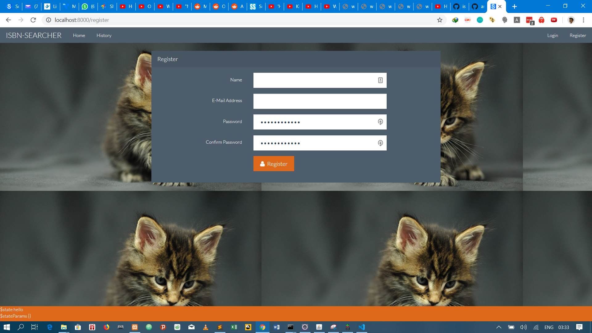
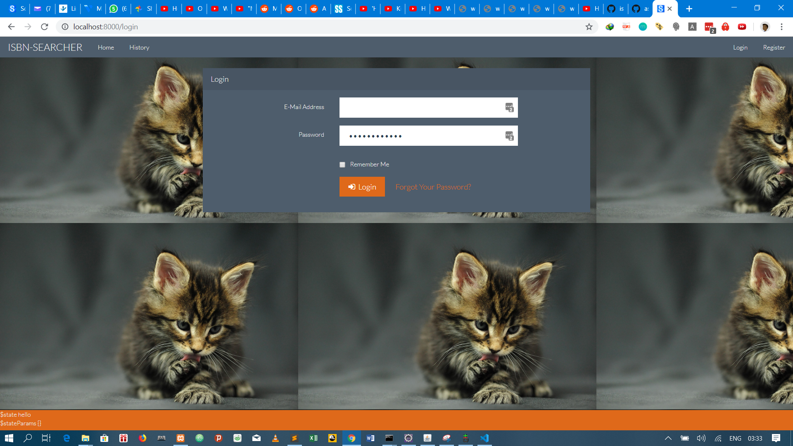
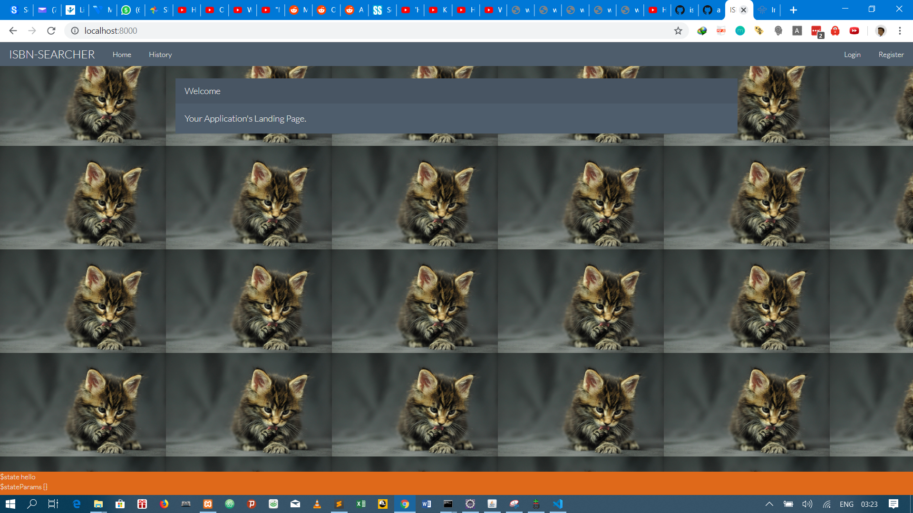
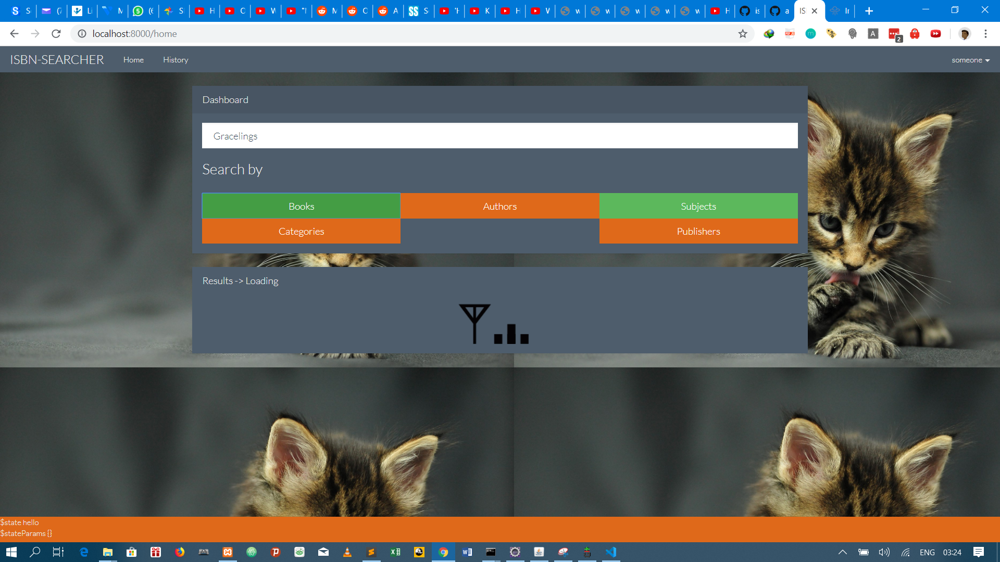
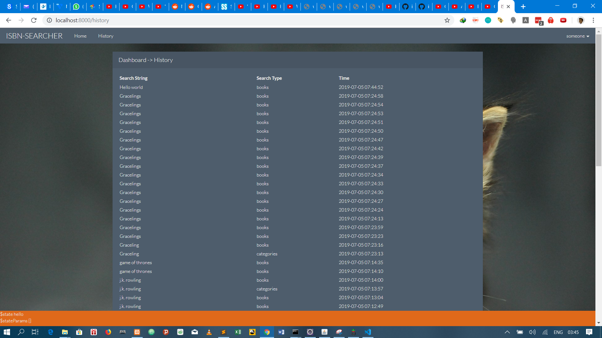

# Introduction 

This a web application build using laravel, AngularJs and bootstrap that interacts with the isbn api 
allowing a user to search for titles and pull extra information from the matches and rendered in the ui

# How to run the application
1. Clone the project
2. Run **composer install** from the project root
3. Run **cp .env.example .env** on unix or **copy .env.example .env** on windows
4. Set DB_USER and DB_PASSWORD to proper values according to the state of your database
5. Run **php artisan key:generate**
5. Run **php artisan migrate**
7. Run **php artisan serve** to start the server and navigate to **http://localhost:8000** in your browser

Snapshot of the application
## Registration page

## Login  page

## Home page

## Search page

## History page 
